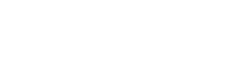

<p align="center">
   <br>
  <a href="https://lavine-software.vercel.app/">lavine-software.vercel.app</a>
</p>

# LSD Website

Welcome to the [LSD website](https://lavine-software.vercel.app/) repository! This project is a modern, responsive website built with Next.js, Tailwind CSS, and Framer Motion. It features a sleek design, smooth animations, and a user-friendly interface. This README will guide you through the project's structure, setup, and usage.

## Table of Contents

- [Features](#features)
- [Technologies Used](#technologies-used)
- [Getting Started](#getting-started)
  - [Prerequisites](#prerequisites)
  - [Installation](#installation)
  - [Running the Project](#running-the-project)
- [Project Structure](#project-structure)
- [Contributing](#contributing)
- [License](#license)
- [Contact](#contact)

## Features

- **Responsive Design**: Optimized for all screen sizes.
- **Smooth Animations**: Powered by Framer Motion for a delightful user experience.
- **Modern UI**: Built with Tailwind CSS for a clean and modern look.
- **Next.js**: Server-side rendering and static site generation for optimal performance.
- **Accessibility**: Ensuring the site is usable for everyone.

## Technologies Used

- **Next.js**: React framework for server-side rendering and static site generation.
- **Tailwind CSS**: Utility-first CSS framework for rapid UI development.
- **Framer Motion**: Library for animations and gestures in React.
- **Font Awesome**: Icon library for scalable vector icons.

## Getting Started

### Prerequisites

Ensure you have the following installed on your machine:

- Node.js (v14 or later)
- npm or yarn

### Installation

1. **Clone the repository:**

   ```sh
   git clone https://github.com/your-username/lsd-site.git
   cd lsd-site
   ```

2. **Install dependencies:**

   Using npm:

   ```sh
   npm install
   ```

   Or using yarn:

   ```sh
   yarn install
   ```

### Running the Project

To start the development server, run:

Using npm:

```sh
npm run dev
```

Or using yarn:

```sh
yarn dev
```

Open your browser and navigate to `http://localhost:3000` to see the site in action.

## Project Structure

```plaintext
lsd-site/
├── public/
│   ├── lsd-logo.png
│   └── ...
├── src/
│   ├── components/
│   │   ├── header.tsx
│   │   ├── dispatch.tsx
│   │   └── ...
│   ├── lib/
│   │   └── data.ts
│   ├── pages/
│   │   ├── index.tsx
│   │   └── ...
│   └── styles/
│       └── globals.css
├── .gitignore
├── package.json
├── README.md
└── ...
```

- **public/**: Static assets like images and fonts.
- **src/components/**: Reusable React components.
- **src/lib/**: Utility functions and data.
- **src/pages/**: Next.js pages.
- **src/styles/**: Global and component-specific styles.

## Contributing

We welcome contributions to improve this project! To contribute:

1. Fork the repository.
2. Create a new branch (`git checkout -b feature-branch`).
3. Make your changes and commit them (`git commit -m 'Add new feature'`).
4. Push to the branch (`git push origin feature-branch`).
5. Open a pull request.

Please ensure your code follows our coding standards and includes relevant tests.

## License

This project is licensed under the Creative Commons Attribution-NonCommercial 4.0 International License.

## Contact

For any inquiries or feedback, please contact:

- **Name**: Bilal Shahnawaz
- **Email**: bilal.shahnawaz@torontomu.ca
- **GitHub**: [your-username](https://github.com/bilalshahnawaz)

Thank you for visiting our project! We hope you find it useful and inspiring.

---

---

Feel free to customize this README to better fit your project's specifics and your personal or organizational branding.
